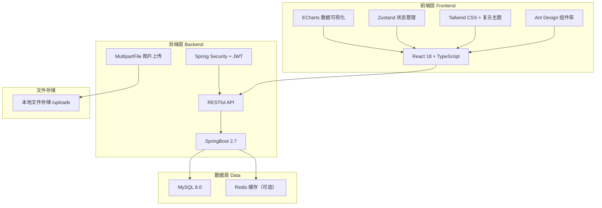
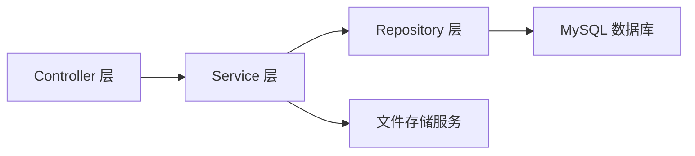
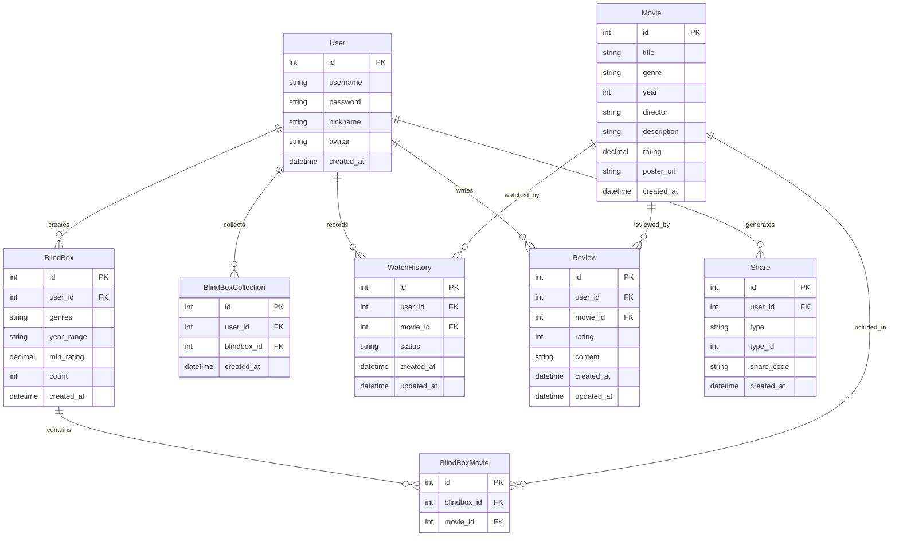

## 1. 架构设计



## 2. 技术说明

- **前端**：React@18 + TypeScript + Ant Design@5 + Tailwind CSS@3 + Vite
- **初始化工具**：vite-init（react-ts 模板）
- **状态管理**：Zustand
- **路由**：react-router-dom@6
- **数据可视化**：ECharts@5
- **HTTP 客户端**：Axios
- **动画库**：framer-motion
- **后端**：SpringBoot 2.7 + Java 11
- **数据库**：MySQL 8.0
- **认证**：JWT Token
- **文件上传**：Spring MultipartFile + 本地存储

## 3. 路由定义

| 路由 | 用途 |
|------|------|
| / | 首页，展示盲盒入口、热门推荐、最近活动 |
| /login | 登录页面 |
| /register | 注册页面 |
| /movies | 电影库列表页 |
| /movies/:id | 电影详情页，含评分评论 |
| /blindbox | 盲盒生成页面，偏好选择+开盒 |
| /collection | 盲盒收藏列表页 |
| /collection/:id | 盲盒收藏详情页 |
| /history | 观影记录页面 |
| /share | 好友分享页面 |
| /share/:id | 分享详情查看页 |
| /stats | 数据统计页面 |

## 4. API 定义

### 4.1 认证接口

```typescript
POST /api/auth/register
Request: { username: string; password: string; nickname: string }
Response: { code: number; message: string; data: { token: string; user: User } }

POST /api/auth/login
Request: { username: string; password: string }
Response: { code: number; message: string; data: { token: string; user: User } }
```

### 4.2 电影接口

```typescript
GET /api/movies?page=1&size=12&genre=科幻&year=2020&keyword=星际
Response: { code: number; data: { list: Movie[]; total: number; page: number; size: number } }

GET /api/movies/:id
Response: { code: number; data: Movie }

POST /api/movies
Request: FormData { title, genre, year, director, description, rating, poster(file) }
Response: { code: number; data: Movie }

PUT /api/movies/:id
Request: FormData { title?, genre?, year?, director?, description?, rating?, poster?(file) }
Response: { code: number; data: Movie }

DELETE /api/movies/:id
Response: { code: number; message: string }
```

### 4.3 盲盒接口

```typescript
POST /api/blindbox/generate
Request: { genres: string[]; yearRange: [number, number]; minRating: number; count: number }
Response: { code: number; data: { blindboxId: number; movies: Movie[]; createdAt: string } }

GET /api/blindbox/my?page=1&size=10
Response: { code: number; data: { list: BlindBox[]; total: number } }

GET /api/blindbox/:id
Response: { code: number; data: BlindBox }

POST /api/blindbox/:id/collect
Response: { code: number; message: string }

DELETE /api/blindbox/:id/collect
Response: { code: number; message: string }

GET /api/blindbox/collections?page=1&size=10
Response: { code: number; data: { list: BlindBox[]; total: number } }
```

### 4.4 观影记录接口

```typescript
POST /api/watch-history
Request: { movieId: number; status: "WANT" | "WATCHING" | "WATCHED" }
Response: { code: number; data: WatchHistory }

PUT /api/watch-history/:id
Request: { status: "WANT" | "WATCHING" | "WATCHED" }
Response: { code: number; data: WatchHistory }

GET /api/watch-history?page=1&size=10&status=WATCHED
Response: { code: number; data: { list: WatchHistory[]; total: number } }

DELETE /api/watch-history/:id
Response: { code: number; message: string }
```

### 4.5 评分评论接口

```typescript
POST /api/reviews
Request: { movieId: number; rating: number; content: string }
Response: { code: number; data: Review }

GET /api/reviews?movieId=1&page=1&size=10
Response: { code: number; data: { list: Review[]; total: number } }

PUT /api/reviews/:id
Request: { rating?: number; content?: string }
Response: { code: number; data: Review }

DELETE /api/reviews/:id
Response: { code: number; message: string }
```

### 4.6 分享接口

```typescript
POST /api/shares
Request: { type: "BLINDBOX" | "MOVIE"; typeId: number }
Response: { code: number; data: { shareId: string; shareUrl: string } }

GET /api/shares/:shareId
Response: { code: number; data: ShareInfo }
```

### 4.7 统计接口

```typescript
GET /api/stats/overview
Response: { code: number; data: { totalWatched: number; totalReviews: number; totalCollections: number; avgRating: number } }

GET /api/stats/genre-distribution
Response: { code: number; data: { genre: string; count: number }[] }

GET /api/stats/monthly-watching
Response: { code: number; data: { month: string; count: number }[] }

GET /api/stats/rating-distribution
Response: { code: number; data: { rating: number; count: number }[] }
```

### 4.8 文件上传接口

```typescript
POST /api/upload/image
Request: FormData { file: File }
Response: { code: number; data: { url: string; filename: string } }
```

## 5. 后端架构图



### SpringBoot 包结构

```
com.cinema.blindbox/
├── controller/          # REST 控制器
│   ├── AuthController
│   ├── MovieController
│   ├── BlindBoxController
│   ├── WatchHistoryController
│   ├── ReviewController
│   ├── ShareController
│   ├── StatsController
│   └── FileUploadController
├── service/             # 业务逻辑层
│   ├── AuthService
│   ├── MovieService
│   ├── BlindBoxService
│   ├── WatchHistoryService
│   ├── ReviewService
│   ├── ShareService
│   └── StatsService
├── repository/          # 数据访问层
│   ├── UserRepository
│   ├── MovieRepository
│   ├── BlindBoxRepository
│   ├── WatchHistoryRepository
│   ├── ReviewRepository
│   └── ShareRepository
├── entity/              # 实体类
├── dto/                 # 数据传输对象
├── config/              # 配置类
│   ├── CorsConfig
│   ├── JwtConfig
│   └── WebMvcConfig
├── util/                # 工具类
│   └── JwtUtil
└── BlindBoxApplication  # 启动类
```

## 6. 数据模型

### 6.1 数据模型定义



### 6.2 数据定义语言（DDL）

```sql
CREATE DATABASE IF NOT EXISTS cinema_blindbox DEFAULT CHARACTER SET utf8mb4 COLLATE utf8mb4_unicode_ci;
USE cinema_blindbox;

CREATE TABLE `user` (
    `id` INT AUTO_INCREMENT PRIMARY KEY,
    `username` VARCHAR(50) NOT NULL UNIQUE,
    `password` VARCHAR(255) NOT NULL,
    `nickname` VARCHAR(50) NOT NULL,
    `avatar` VARCHAR(255) DEFAULT '',
    `created_at` DATETIME DEFAULT CURRENT_TIMESTAMP
) ENGINE=InnoDB DEFAULT CHARSET=utf8mb4;

CREATE TABLE `movie` (
    `id` INT AUTO_INCREMENT PRIMARY KEY,
    `title` VARCHAR(100) NOT NULL,
    `genre` VARCHAR(50) NOT NULL,
    `year` INT NOT NULL,
    `director` VARCHAR(100) DEFAULT '',
    `description` TEXT,
    `rating` DECIMAL(2,1) DEFAULT 0.0,
    `poster_url` VARCHAR(255) DEFAULT '',
    `created_at` DATETIME DEFAULT CURRENT_TIMESTAMP
) ENGINE=InnoDB DEFAULT CHARSET=utf8mb4;

CREATE TABLE `blindbox` (
    `id` INT AUTO_INCREMENT PRIMARY KEY,
    `user_id` INT NOT NULL,
    `genres` VARCHAR(255) DEFAULT '',
    `year_range` VARCHAR(50) DEFAULT '',
    `min_rating` DECIMAL(2,1) DEFAULT 0.0,
    `count` INT DEFAULT 5,
    `created_at` DATETIME DEFAULT CURRENT_TIMESTAMP,
    FOREIGN KEY (`user_id`) REFERENCES `user`(`id`) ON DELETE CASCADE
) ENGINE=InnoDB DEFAULT CHARSET=utf8mb4;

CREATE TABLE `blindbox_movie` (
    `id` INT AUTO_INCREMENT PRIMARY KEY,
    `blindbox_id` INT NOT NULL,
    `movie_id` INT NOT NULL,
    FOREIGN KEY (`blindbox_id`) REFERENCES `blindbox`(`id`) ON DELETE CASCADE,
    FOREIGN KEY (`movie_id`) REFERENCES `movie`(`id`) ON DELETE CASCADE
) ENGINE=InnoDB DEFAULT CHARSET=utf8mb4;

CREATE TABLE `blindbox_collection` (
    `id` INT AUTO_INCREMENT PRIMARY KEY,
    `user_id` INT NOT NULL,
    `blindbox_id` INT NOT NULL,
    `created_at` DATETIME DEFAULT CURRENT_TIMESTAMP,
    UNIQUE KEY `uk_user_blindbox` (`user_id`, `blindbox_id`),
    FOREIGN KEY (`user_id`) REFERENCES `user`(`id`) ON DELETE CASCADE,
    FOREIGN KEY (`blindbox_id`) REFERENCES `blindbox`(`id`) ON DELETE CASCADE
) ENGINE=InnoDB DEFAULT CHARSET=utf8mb4;

CREATE TABLE `watch_history` (
    `id` INT AUTO_INCREMENT PRIMARY KEY,
    `user_id` INT NOT NULL,
    `movie_id` INT NOT NULL,
    `status` ENUM('WANT','WATCHING','WATCHED') DEFAULT 'WANT',
    `created_at` DATETIME DEFAULT CURRENT_TIMESTAMP,
    `updated_at` DATETIME DEFAULT CURRENT_TIMESTAMP ON UPDATE CURRENT_TIMESTAMP,
    UNIQUE KEY `uk_user_movie` (`user_id`, `movie_id`),
    FOREIGN KEY (`user_id`) REFERENCES `user`(`id`) ON DELETE CASCADE,
    FOREIGN KEY (`movie_id`) REFERENCES `movie`(`id`) ON DELETE CASCADE
) ENGINE=InnoDB DEFAULT CHARSET=utf8mb4;

CREATE TABLE `review` (
    `id` INT AUTO_INCREMENT PRIMARY KEY,
    `user_id` INT NOT NULL,
    `movie_id` INT NOT NULL,
    `rating` INT NOT NULL CHECK (`rating` BETWEEN 1 AND 10),
    `content` TEXT,
    `created_at` DATETIME DEFAULT CURRENT_TIMESTAMP,
    `updated_at` DATETIME DEFAULT CURRENT_TIMESTAMP ON UPDATE CURRENT_TIMESTAMP,
    FOREIGN KEY (`user_id`) REFERENCES `user`(`id`) ON DELETE CASCADE,
    FOREIGN KEY (`movie_id`) REFERENCES `movie`(`id`) ON DELETE CASCADE
) ENGINE=InnoDB DEFAULT CHARSET=utf8mb4;

CREATE TABLE `share` (
    `id` INT AUTO_INCREMENT PRIMARY KEY,
    `user_id` INT NOT NULL,
    `type` ENUM('BLINDBOX','MOVIE') NOT NULL,
    `type_id` INT NOT NULL,
    `share_code` VARCHAR(32) NOT NULL UNIQUE,
    `created_at` DATETIME DEFAULT CURRENT_TIMESTAMP,
    FOREIGN KEY (`user_id`) REFERENCES `user`(`id`) ON DELETE CASCADE
) ENGINE=InnoDB DEFAULT CHARSET=utf8mb4;

-- 初始电影数据
INSERT INTO `movie` (`title`, `genre`, `year`, `director`, `description`, `rating`, `poster_url`) VALUES
('肖申克的救赎', '剧情', 1994, '弗兰克·德拉邦特', '两个被囚禁的人在多年的监禁中结下了友谊，通过共同的善意行为找到了慰藉和最终的救赎。', 9.7, ''),
('霸王别姬', '剧情', 1993, '陈凯歌', '两个京剧演员半个世纪的悲欢离合，揭示了一段波澜壮阔的历史。', 9.6, ''),
('阿甘正传', '剧情', 1994, '罗伯特·泽米吉斯', '一个智商只有75的人，却用纯真和善良创造了一个又一个奇迹。', 9.5, ''),
('泰坦尼克号', '爱情', 1997, '詹姆斯·卡梅隆', '在注定沉没的豪华邮轮上，来自不同社会阶层的两个人坠入爱河。', 9.4, ''),
('星际穿越', '科幻', 2014, '克里斯托弗·诺兰', '一队探险者利用虫洞穿越时空，为拯救人类而进行星际旅行。', 9.4, ''),
('盗梦空间', '科幻', 2010, '克里斯托弗·诺兰', '一个专门在人们梦境中窃取秘密的盗贼，接受了一个看似不可能的任务。', 9.3, ''),
('千与千寻', '动画', 2001, '宫崎骏', '少女千寻意外来到神灵世界，为了拯救父母而努力工作成长的故事。', 9.4, ''),
('楚门的世界', '剧情', 1998, '彼得·威尔', '一个人从出生起就生活在一个巨大的摄影棚中，他的一生都是一档真人秀。', 9.3, ''),
('忠犬八公的故事', '剧情', 2009, '拉斯·霍尔斯特罗姆', '一只忠诚的秋田犬在主人去世后，依然每天在车站等待主人归来。', 9.4, ''),
('疯狂动物城', '动画', 2016, '拜伦·霍华德', '在动物城市中，一只兔子警官和一只狐狸骗子联手破案。', 9.2, ''),
('寄生虫', '剧情', 2019, '奉俊昊', '一个贫穷家庭巧妙地渗透到一个富裕家庭中，揭示社会阶层鸿沟。', 9.0, ''),
('流浪地球', '科幻', 2019, '郭帆', '太阳即将毁灭，人类启动流浪地球计划，带着地球一起寻找新家园。', 8.5, ''),
('你的名字', '动画', 2016, '新海诚', '两个素未谋面的少年少女，在梦中交换身体，展开了一段跨越时空的爱情。', 8.9, ''),
('教父', '犯罪', 1972, '弗朗西斯·福特·科波拉', '柯里昂家族的传奇故事，展现了黑手党世界的权力与家庭。', 9.3, ''),
('沉默的羔羊', '惊悚', 1991, '乔纳森·戴米', 'FBI实习特工与被囚禁的连环杀手之间的心理博弈。', 9.0, ''),
('大话西游之大圣娶亲', '喜剧', 1995, '刘镇伟', '至尊宝为了救白晶晶穿越回五百年前，遇到了紫霞仙子。', 9.2, ''),
('无间道', '犯罪', 2002, '刘伟强/麦兆辉', '警方和黑社会各自安插卧底在对方阵营中，展开一场殊死较量。', 9.3, ''),
('机器人总动员', '动画', 2008, '安德鲁·斯坦顿', '一个孤独的垃圾清理机器人在荒废的地球上找到了爱情和使命。', 9.3, ''),
('哈利·波特与魔法石', '奇幻', 2001, '克里斯·哥伦布', '一个孤儿男孩在11岁生日时发现自己是一名巫师，进入了魔法世界。', 9.1, ''),
('指环王：王者归来', '奇幻', 2003, '彼得·杰克逊', '弗罗多和山姆最终抵达末日火山，中土世界的命运之战即将打响。', 9.2, '');
```
